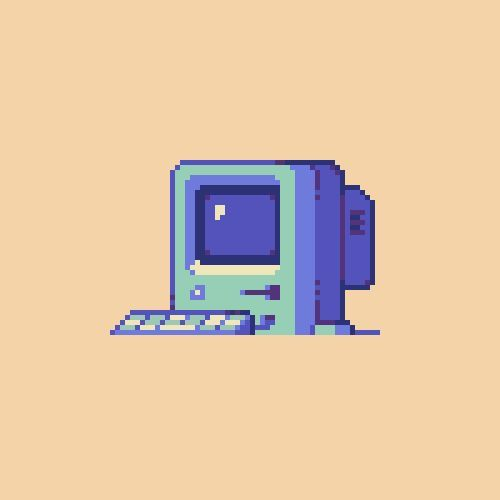

<h1 align="center">
🖥️ FiapPC
</h1>

> Repositório que uso antes da aula para fazer o PC da Fiap ter configurações e utilidades parecidas com o meu

  
<h3><b>Índice</b></h3>

  <ol>
    <li><a href="#autores">Autores</a></li>
  </ol>

<h2 name="autores">✍️ Autores</h2>

| [ Asteriuz](https://github.com/Asteriuz) |
| :---: |

---

[⬆ Voltar ao topo](#rainha) 
